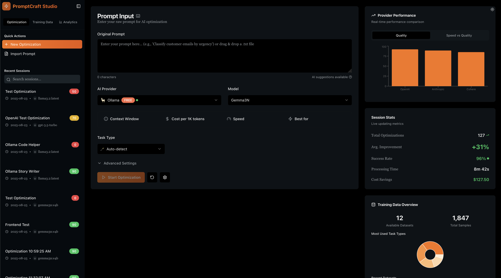

# PromptCraft

A sophisticated AI-powered prompt optimization platform with FastAPI backend and Next.js frontend. Features real-time optimization, comprehensive analytics, and **local AI support via Ollama** - no external API keys required!



## 🔬 Research Inspiration

This project was inspired by the research paper ["Automated Prompt Engineering for Large Language Models"](https://arxiv.org/abs/2507.14241), which explores systematic approaches to prompt optimization and engineering. Building on these academic foundations, I created a practical frontend utility that automates prompt optimization workflows, making advanced prompt engineering techniques accessible through an intuitive user interface.

This implementation combines the theoretical insights from the research with real-world usability, providing both novice and expert users with powerful tools to enhance their AI interactions through optimized prompting strategies.

## 🏗️ Project Structure

```
PromptCraft/
├── Web/                    # Next.js Frontend
├── API/                    # FastAPI Backend
├── package.json           # Root package.json for convenience scripts
└── README.md              # This file
```

## ✨ Features

### 🚀 Core Functionality
- **Local AI with Ollama**: Complete privacy with local model execution - no external API keys needed
- **Real-time Prompt Optimization**: Advanced algorithms including DSPy and meta-prompting
- **Live Performance Tracking**: Real-time analytics and session monitoring
- **Interactive Results**: Before/after comparisons with improvement scores
- **Multiple Local Models**: Support for Llama, Mistral, CodeLlama, and other Ollama models

### 📊 Analytics & Monitoring
- **Performance Metrics**: Success rates, improvement scores, and cost tracking
- **Provider Analytics**: Comparative analysis across different AI providers
- **Session History**: Searchable optimization history with filtering
- **Real-time Charts**: Interactive visualizations of optimization trends

### 🗂️ Data Management
- **Session Persistence**: SQLite database for optimization history
- **Training Data**: Dataset management and analytics
- **API Configuration**: Health monitoring and connection status
- **Export/Import**: Session and data portability

## 🚀 Quick Start

### Prerequisites

- **Node.js** 18.0.0 or higher
- **Python** 3.11 or higher
- **npm/yarn** package manager
- **Ollama** (required for AI functionality) - [Install Ollama](https://ollama.ai/)

### Installation

1. **Clone the repository**
   ```bash
   git clone <repository-url>
   cd PromptCraft
   ```

2. **Install and Start Ollama**
   ```bash
   # Option A: Use our setup script (Recommended)
   cd API
   ./setup_ollama.sh
   
   # Option B: Manual setup
   curl -fsSL https://ollama.ai/install.sh | sh
   ollama serve  # Start Ollama service
   ollama pull llama3.2:latest  # Pull models
   ollama pull mistral:7b
   ```

3. **Quick Setup (Recommended)**
   ```bash
   # Install all dependencies
   npm run install:web
   npm run install:api
   
   # Set up environment variables
   cp API/.env.example API/.env
   # No API keys needed - just verify Ollama URL
   ```

4. **Manual Setup**

   **Backend Setup:**
   ```bash
   # Install backend dependencies
   cd API
   pip install -r requirements.txt
   
   # Create environment file
   cp .env.example .env
   ```
   
   Edit `API/.env` for Ollama configuration:
   ```env
   # Ollama Configuration (Required)
   OLLAMA_BASE_URL=http://localhost:11434
   DEFAULT_MODEL_NAME=llama3.2:latest
   
   # Database
   DATABASE_URL=sqlite:///./app.db
   ```

   **Frontend Setup:**
   ```bash
   # Install frontend dependencies
   cd Web
   npm install --legacy-peer-deps
   ```

4. **Start the Application**

   **Option 1: Start both services together (Recommended)**
   ```bash
   # From project root
   npm run dev
   ```
   
   **Option 2: Start services separately**
   ```bash
   # Terminal 1 - Backend
   npm run dev:api
   
   # Terminal 2 - Frontend  
   npm run dev:web
   ```
   
   - Backend: http://127.0.0.1:8000
   - Frontend: http://localhost:3000

   Once both are up, `npm run dev` prints a block of clickable links (web app, API health, API docs). In iTerm2 and VS Code they open with Cmd+click; in macOS Terminal use Cmd+double-click.

## 🧪 Testing Your Setup

After installation, verify everything works correctly:

### Quick Test
```bash
# Run automated setup tests
./test_setup.sh
```

### Full Optimization Test
```bash
# Start the API server (in one terminal)
cd API && make dev

# Run optimization tests (in another terminal)
python test_optimization.py
```

### Manual Testing
See [TESTING_GUIDE.md](TESTING_GUIDE.md) for comprehensive manual testing instructions.

## 🏗️ Detailed Architecture

### Backend (FastAPI) - `API/`
```
API/
├── app/
│   ├── api/
│   │   └── v1/
│   │       ├── endpoints/        # API endpoints
│   │       │   ├── sessions.py   # Session management
│   │       │   ├── providers.py  # AI provider integration
│   │       │   ├── training.py   # Training data
│   │       │   └── datasets.py   # Dataset management
│   │       └── router.py         # API routing
│   ├── core/
│   │   ├── config.py            # Configuration
│   │   └── database.py          # Database setup
│   ├── models/                  # SQLAlchemy models
│   ├── schemas/                 # Pydantic schemas
│   ├── services/                # Business logic
│   │   ├── optimization_service.py  # Core optimization
│   │   ├── ollama_service.py        # Ollama integration
│   │   └── lm_manager.py            # Language model management
│   └── main.py                  # FastAPI application
├── app.db                       # SQLite database
├── requirements.txt             # Python dependencies
├── .env.example                 # Environment template
└── pyproject.toml              # Project configuration
```

### Frontend (Next.js) - `Web/`
```
Web/
├── app/                        # Next.js app directory
│   ├── globals.css            # Global styles
│   ├── layout.tsx             # Root layout
│   └── page.tsx               # Main page
├── components/
│   ├── ui/                    # shadcn/ui components
│   ├── optimization-dashboard.tsx  # Main dashboard
│   ├── session-sidebar.tsx        # Session management
│   └── theme-provider.tsx          # Theme management
├── lib/
│   ├── api/                   # API integration
│   │   ├── client.ts          # API client
│   │   └── hooks.ts           # React hooks
│   └── utils.ts               # Utilities
├── types/
│   └── index.ts               # TypeScript types
└── package.json               # Frontend dependencies
```

## 🔗 API Endpoints

### Sessions
- `GET /api/v1/sessions/` - List all optimization sessions
- `POST /api/v1/sessions/` - Create a new session
- `GET /api/v1/sessions/{id}` - Get specific session
- `POST /api/v1/sessions/{id}/optimize` - Optimize prompt and wait (body: `optimization_method`, advanced settings, optional `dataset_id` + `eval_metric` + `max_demos` to measure against a dataset)
- `POST /api/v1/sessions/{id}/optimize/start` - Same body, returns 202 immediately; the web app uses this
- `GET /api/v1/sessions/{id}/optimize/status` - Stage, progress, best score so far, and the result when finished
- `POST /api/v1/sessions/{id}/feedback` - Thumbs up/down and a note on the optimized prompt
- `GET /api/v1/sessions/analytics/performance` - Performance metrics, including feedback counts

### Training Data
- `GET /api/v1/training/` - List datasets (newest first, with average sample quality)
- `GET /api/v1/training/stats` - Totals and per-task-type breakdown for dashboards
- `POST /api/v1/training/` - Create a dataset
- `POST /api/v1/training/import` - Import a dataset from JSON or CSV text
- `POST /api/v1/training/{id}/export` - Export as JSON or CSV
- `POST /api/v1/training/{id}/generate` - Generate synthetic samples with a local model
- `GET /api/v1/training/{id}/samples` - List samples
- `DELETE /api/v1/training/{id}` - Delete a dataset and its samples

### Providers
- `GET /api/v1/providers/` - List AI providers and models
- `GET /api/v1/providers/ollama/health` - Check Ollama status
- `GET /api/v1/providers/ollama/models` - List Ollama models

### System
- `GET /health` - API health check
- `GET /` - API information

## 🧪 Testing the Application

### 1. Backend API Test
```bash
# Test backend health
curl http://127.0.0.1:8000/health

# Test sessions endpoint
curl http://127.0.0.1:8000/api/v1/sessions/

# Test providers
curl http://127.0.0.1:8000/api/v1/providers/
```

### 2. Frontend Integration Test
1. Open http://localhost:3000 in your browser
2. Check that sessions load in the sidebar (should show existing sessions)
3. Verify providers populate in the dashboard dropdown
4. Test optimization flow:
   - Enter prompt: "Help me write better emails"
   - Select Ollama provider
   - Choose an available model
   - Click "Start Optimization"
   - Wait for optimized result

### 3. Full Integration Test
- Create optimization session via frontend
- Verify it appears in backend API
- Check analytics update with new data
- Test session persistence after page refresh

## 🎯 Optimization Methods

The application supports multiple optimization techniques:

- **Meta-Prompt**: One structured rewrite guided by a prompt-engineering rubric
- **DSPy Chain-of-Thought**: The model reasons about the prompt first, then rewrites it
- **GEPA**: Evolves the instructions from written feedback on a dataset (see below)
- **Simple**: A plain completion asked to improve the prompt

### GEPA: reflective prompt evolution

Pick a dataset and the GEPA method, and the prompt is evolved rather than rewritten once. Each generation runs the current prompt on a few training samples, the metric writes feedback for every miss (for example "the right label is buried in a 40-word answer"), and a reflection model rewrites the instructions to address that feedback. Candidates that win on different samples stay on a Pareto front and can be merged. The Prompt Evolution card shows the whole lineage: every candidate, its score on the held-out split, its parent, and the feedback it was bred from, with changes highlighted against the parent. A budget of 60 scored calls takes about a minute on a 3B model with 16 samples; a larger reflection model can be chosen separately from the task model. Based on [GEPA (Agrawal et al., 2025)](https://arxiv.org/abs/2507.19457).

### Measuring a prompt against a dataset

Pick a training dataset when optimizing and the score stops being a heuristic. The dataset is split into train and held-out samples; the original prompt, the rewrite, and few-shot versions of each (examples selected by DSPy's `BootstrapFewShot` on the train split) are all scored on the held-out samples with the chosen metric (`exact`, `contains`, or a model judge; `auto` picks by answer length). The best candidate is returned as a plain-text prompt with a `{input}` placeholder, alongside the full scoreboard and per-sample results. Each candidate costs roughly one model call per held-out sample, so a 10-sample dataset on a local 3B model takes about 20 seconds.

For label datasets the split is class-balanced, so a two-sample held-out set is not two samples of the same label. Small datasets can use **k-fold** instead: every sample is held out once across up to five folds, each candidate type is scored on all of them, and the winner is refit on the whole dataset. The score then moves in steps of 1/N instead of 1/held-out, at about five times the model calls.

Few-shot examples are chosen for coverage, not by order: BootstrapFewShot validates a pool of examples the model can reproduce, then the ones that best span the training inputs are kept, picked by farthest-point sampling over `nomic-embed-text` embeddings with one example per class first. Each kept example is shown with the inputs it stands in for. The same embeddings reject near-duplicates during synthetic data generation. Both fall back gracefully if the embedding model is not installed (`ollama pull nomic-embed-text`).

### Database migrations

The schema is managed with Alembic. The API applies pending migrations on startup, so an existing `app.db` is upgraded in place; to run them by hand:

```bash
cd API && alembic upgrade head
```

## 🔧 DSPy Integration

PromptCraft leverages [DSPy](https://github.com/stanfordnlp/dspy) (Declarative Self-improving Language Programs) as a core framework for systematic prompt optimization. DSPy provides a programmatic approach to prompt engineering through composable modules and type-safe signatures. In this project, DSPy serves as the abstraction layer between the optimization service and local AI models via Ollama, enabling privacy-focused prompt optimization without external API dependencies. The integration uses DSPy's `LM` class for unified model management, `context()` for thread-safe operations in async environments, and sophisticated predictors like `Predict()` and `ChainOfThought()` for multi-step reasoning tasks. The architecture implements custom DSPy signatures with `InputField` and `OutputField` definitions, allowing structured prompt transformations with clear input/output contracts. This foundation supports the meta-prompt optimization method and enables task-specific prompt engineering for code generation, creative writing, analysis, and translation workflows, providing measurable improvement scores (0-100) with detailed performance metadata for each optimization session.

## 🛠️ Available Scripts

### Root Level (Convenience Scripts)
```bash
# Development (both services)
npm run dev

# Install dependencies
npm run install:web
npm run install:api

# Production
npm run start

# Linting
npm run lint:web

# Clean build artifacts
npm run clean
```

### Backend (API/)
```bash
# Start development server
cd API && python -m uvicorn app.main:app --reload

# Run tests
cd API && python -m pytest tests/ -v

# Install dependencies
cd API && pip install -r requirements.txt
```

### Frontend (Web/)
```bash
# Development
cd Web && npm run dev

# Production build
cd Web && npm run build
cd Web && npm start

# Linting
cd Web && npm run lint

# Install dependencies
cd Web && npm install --legacy-peer-deps
```

## 🧩 Technology Stack

### Backend
- **FastAPI** - Modern Python web framework
- **SQLAlchemy** - Database ORM
- **Pydantic** - Data validation
- **DSPy** - Prompt optimization framework
- **httpx** - Async HTTP client
- **SQLite** - Database storage

### Frontend
- **Next.js 15** - React framework with App Router
- **TypeScript** - Type safety
- **Tailwind CSS** - Utility-first styling
- **shadcn/ui** - Component library
- **Recharts** - Data visualization
- **Lucide** - Icons

## 🔧 Configuration

### Environment Variables

#### Backend (.env in API/)
```env
# Ollama (the only provider this build drives; no API keys needed)
OLLAMA_BASE_URL=http://localhost:11434
DEFAULT_MODEL_NAME=llama3.2:latest

# Application settings
DATABASE_URL=sqlite:///./app.db
LOG_LEVEL=INFO
```

See `API/.env.example` for the full list, including optional API-key auth and the evaluation caps.

#### Frontend
No environment variables required for basic functionality.

## 🚨 Troubleshooting

### Common Issues

1. **CORS errors**: Ensure backend is running on 127.0.0.1:8000
2. **Module not found**: Run `npm install --legacy-peer-deps`
3. **Ollama not connecting**: Check Ollama is running with `ollama serve`
4. **Database errors**: Delete `app.db` and restart backend to recreate

### Debug Commands
```bash
# Check if services are running
curl http://127.0.0.1:8000/health
curl -I http://localhost:3000

# Check Ollama
curl http://localhost:11434/api/tags

# View logs (if logging is enabled)
tail -f API/logs/*

# Check API directly
curl http://127.0.0.1:8000/api/v1/sessions/
curl http://127.0.0.1:8000/api/v1/providers/
```

## 📈 Performance

- **Frontend**: Optimized React components with proper loading states
- **Backend**: Async FastAPI with SQLite for fast local development
- **Caching**: API response caching for improved performance
- **Real-time**: WebSocket support for live optimization updates

## 🤝 Contributing

1. Fork the repository
2. Create feature branch (`git checkout -b feature/amazing-feature`)
3. Commit changes (`git commit -m 'Add amazing feature'`)
4. Push to branch (`git push origin feature/amazing-feature`)
5. Open Pull Request

## 📄 License

This project is licensed under the MIT License - see the [LICENSE](LICENSE) file for details.

## 🆘 Support

- **Issues**: Open a GitHub issue for bugs and feature requests
- **Documentation**: Check the `/docs` directory for detailed guides
- **API Docs**: Visit http://127.0.0.1:8000/docs when backend is running

---

**Built using FastAPI, Next.js, and modern AI optimization techniques**