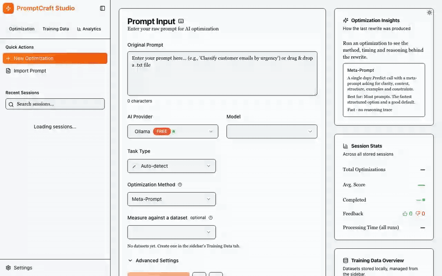

<p align="center">
  <picture>
    <source media="(prefers-color-scheme: dark)" srcset="docs/logo-dark.svg">
    
  </picture>
</p>

<h4 align="center">Local, private prompt optimization powered by DSPy and Ollama.</h4>

<p align="center">
  <a href="https://github.com/shirkattack/PromptCraft/actions/workflows/ci.yml"></a>
  <a href="https://github.com/shirkattack/PromptCraft/commits/main"></a>
  <a href="https://github.com/shirkattack/PromptCraft/issues"></a>
  <a href="https://github.com/shirkattack/PromptCraft/pulls"></a>
  <a href="LICENSE"></a>
</p>

<p align="center">
  <a href="#usage">Usage</a> •
  <a href="#installation">Installation</a> •
  <a href="#optimization-methods">Methods</a> •
  <a href="#configuration">Configuration</a> •
  <a href="#architecture">Architecture</a> •
  <a href="#development">Development</a> •
  <a href="#troubleshooting">Troubleshooting</a> •
  <a href="#credits">Credits</a> •
  <a href="#license">License</a>
</p>

---

<table>
<tr>
<td>

**PromptCraft** takes a rough prompt, rewrites it with a local model, and shows you the before, the after, and a score. Everything runs on your machine through [Ollama](https://ollama.com); nothing leaves it and no API keys are needed.

Give it a small dataset and the score stops being a guess: candidates are measured on held-out examples, few-shot examples are picked for coverage, and the **GEPA** method evolves your instructions from written feedback on every miss, showing you the lineage of each edit.

<p align="center"></p>

</td>
</tr>
</table>

## Usage

Open <http://localhost:3000>, paste a prompt, pick a model and a method, and click **Start Optimization**. The run happens in the background with live progress; the result appears alongside the original with a score, and a session entry you can rate and come back to.

Every example below is a real run on `llama3.2` (3B) from this repository.

#### Example 1: a rough prompt, rewritten

**Before**

```
Help me write a python script that makes exact change.
```

**After** · Meta-Prompt · 6.0s · heuristic score 70/100

```
Help me write a precise Python script that generates exact change for a given
amount, considering denominations of $1, $5, $10, and $20. Please provide the total
amount and the available denominations as input, and the output should be a list
of coins that makes up the exact change, with each coin value represented by its
denomination (e.g., 1 for $1, 5 for $5, 10 for $10, and 20 for $20). The output
format should be a comma-separated string of coin values, with no duplicates.
Ensure the script is able to handle amounts up to $100 and denominations, and
provide clear instructions on how to use it.
```

Without a dataset the score is a structural heuristic (length, sections, examples, constraints), and the UI says so. The next two examples replace it with a measurement.

Whatever the score, the **Try it** card under the result runs the original and the optimized prompt on an input you type, with the same model, and shows both answers side by side with timing. After a measured run it can pick a held-out sample for you and says whether each answer matched the expected output.

Thumbs-down a result and leave a note ("too long", "changed the meaning") and the next optimization of that prompt takes it into account: the rewrite methods treat it as a constraint, and GEPA's reflection reads it next to every miss. Optimization Insights lists the notes that were used.

#### Example 2: measuring against a dataset

A dataset is a list of **inputs** and the **outputs** you expect for them. The prompt you optimize is the *instruction* that should turn one input into its output; the app appends each input to your prompt where `{input}` goes, runs it, and compares the answer with the expected output.

To try it with the bundled dataset, [`docs/examples/support-tickets.csv`](docs/examples/support-tickets.csv):

1. **Training Data** tab in the sidebar → **Import Dataset** → choose the CSV file (or paste it) → Import.
2. Paste this as the prompt: `Classify the priority of this support ticket as high, medium or low.`
3. Under **Measure against a dataset**, pick *Support ticket priority*.
4. Pick a method (Meta-Prompt to start, GEPA for Example 3) and click **Start Optimization**.

Not sure what instruction fits a dataset? After picking it, click **Insert a starter prompt**: the app writes one from the dataset's own outputs (a list of labels for classification-style data, an example pair otherwise).


**Bring your own data.** Any of these layouts import, from a file or pasted text:

```jsonc
// JSON: an array of objects
[{"input": "Server is down", "output": "high"}, {"input": "Thanks!", "output": "low"}]
// JSON Lines: one object per line (handy for large or appended files; otherwise equivalent)
{"input": "Server is down", "output": "high"}
{"input": "Thanks!", "output": "low"}
```

```csv
input,output
"Server is down",high
```

Key aliases are accepted (`prompt`/`response`, `question`/`answer`, `text`/`label`, `input_text`/`expected_output`); other fields are kept as extra data. Ten to twenty varied samples are enough to start, and a label dataset should include every label. The Import dialog has templates and the same notes under its help icon.

The bundled CSV looks like this:

```csv
input,output
"Production database is down, all customers affected",high
"Question about how billing cycles work",medium
"Thanks for the quick help yesterday!",low
...
```

**Growing the dataset.** *Generate Dataset* asks a local model for more samples in the same style. Near-duplicates of what you already have, judged by `nomic-embed-text` embeddings, are rejected and reported. Six samples, 4.3s:

```
high    User has not received their order and is requesting a refund.
medium  Customer is experiencing a minor issue with their product, such as a small scratch...
medium  User is requesting a password reset for an account that has been inactive for 6 months.
high    Customer is reporting a critical issue with their product, such as a malfunction...
```

**Measuring.** Pick the dataset when you optimize. The original prompt, the rewrite, and few-shot variants of each are all scored on samples the optimizer never saw. Here the dataset had 18 samples and k-fold scoring held each one out once across five class-balanced folds:

| Candidate | Score on all 18 samples |
| --- | ---: |
| Original prompt (baseline) | 50% |
| Rewrite | 33% |
| Rewrite + examples | 39% |
| **Original + examples** (selected) | **56%** |

The few-shot examples are not the first that happened to pass. BootstrapFewShot validated 12 the model could reproduce; the 3 that best span the training inputs were kept, one per class first, and each is shown with the inputs it stands in for:

```
Two-factor codes never arrive, cannot access account  → high
  covers inputs like "User has not received their order...", "Cannot log in since this morning..."
Would like to change the email on my account          → medium
  covers inputs like "User is requesting a password reset...", "Customer is requesting a feature..."
```

The returned prompt is plain text with an `{input}` placeholder:

```
Classify the priority of this support ticket as high, medium or low.

Examples:

Input: Two-factor codes never arrive, cannot access account
Output: high

Input: Would like to change the email on my account
Output: medium

Input: {input}
Output:
```

#### Example 3: GEPA, evolving the instructions from feedback

With a dataset you can also pick **GEPA**. Instead of one rewrite, the prompt is evolved: it runs on training samples, the metric writes feedback for each miss, a reflection model rewrites the instructions to address it, and candidates that win on different samples are kept and merged. Same 18-sample dataset, budget of 60 scored calls, 82s:

| | Held-out score |
| --- | ---: |
| Original prompt | 25% |
| **Evolved (candidate 2, generation 2)** | **87.5%** |

The Prompt Evolution card shows why each candidate exists. The feedback the reflection read before proposing the winner:

```
The right answer 'medium' is in the response but buried in 19 words.
Respond with 'medium' alone, no explanation.
```

and the instructions it wrote in response (excerpt):

```
Classify the severity of a user request as high, medium, or low. The severity level
should be based on the impact it has on the user's experience, the resources required
for resolution, and the potential risk of data loss or other adverse consequences.
...
Respond with a single word indicating the severity level: 'high', 'medium', or 'low'.
```

Every candidate is listed with its score, its parent, and a word diff against that parent. If nothing beats the original, the original is kept and the card says so.

> [!TIP]
> Small local models are weak reflectors. The *Reflection model* picker lets a larger model write the instructions while the small one does the fast scoring calls.

## Installation

#### Requirements

- [Ollama](https://ollama.com/download)
- [uv](https://docs.astral.sh/uv/getting-started/installation/) (falls back to `python -m venv` + pip if missing; Python 3.11+ either way)
- [Node.js](https://nodejs.org) 18+

#### Steps

1. **Install Ollama** and pull a model. Any model from the [Ollama library](https://ollama.com/library) works; `llama3.2` is a good default. The embedding model is optional but enables coverage-based example selection and de-duplication.

   ```sh
   ollama pull llama3.2
   ollama pull nomic-embed-text
   ```

2. **Clone and install.**

   ```sh
   git clone https://github.com/shirkattack/PromptCraft.git
   cd PromptCraft
   npm install
   ```

   `npm install` runs `uv sync` in `API/`, `npm install` in `Web/`, and copies `API/.env.example` to `API/.env` if it does not exist.

3. **Run.**

   ```sh
   npm run dev
   ```

   Once both servers are up, a block of clickable links is printed: Web app <http://localhost:3000> · API <http://127.0.0.1:8000> · API docs <http://127.0.0.1:8000/docs>

> [!NOTE]
> Ollama runs as a background service after install. If the app reports it can't connect, start it with `ollama serve`.

> [!NOTE]
> Models are listed with the configured default first, then smallest to largest, so the fast one is selected by default. Change `DEFAULT_MODEL_NAME` in `API/.env` to prefer another. See [Configuration](#configuration).

---

## Optimization methods

<details>
<summary>Expand</summary>

| Method | What it does | Needs a dataset |
| --- | --- | :-: |
| **Meta-Prompt** | One structured rewrite guided by a prompt-engineering rubric (`dspy.Predict`). The fastest structured option and a good default. | |
| **DSPy Chain-of-Thought** | `dspy.ChainOfThought` over a rewrite signature: the model reasons about what the prompt needs, then rewrites it; the reasoning is shown. Falls back to a template if the model cannot follow the structured format, and says so. | |
| **GEPA** | Reflective prompt evolution (`dspy.teleprompt.GEPA`): feedback on every miss, a reflection model rewrites the instructions, a Pareto front of candidates. Returns the whole lineage. | yes |
| **Simple** | A plain completion asked to improve the prompt. A quick baseline. | |

Any method plus a dataset turns on measurement: hold-out or k-fold splits (class-balanced for label datasets), `exact`, `contains` or model-judge metrics (`auto` picks by answer length), few-shot candidates compiled with `BootstrapFewShot`, and examples chosen for coverage with `nomic-embed-text` embeddings. Advanced settings cover temperature, max tokens, output format, target length, preserving wording, the metric, the split strategy, the example cap, the GEPA budget and the reflection model.

#### How DSPy is used

[DSPy](https://dspy.ai) ([GitHub](https://github.com/stanfordnlp/dspy)) is the layer between the optimization service and Ollama: `dspy.LM` for model management, `dspy.context()` so each worker thread binds its own model, `Predict` and `ChainOfThought` over typed signatures for the rewrites, `BootstrapFewShot` to validate few-shot examples, `Evaluate` for held-out scoring, and `GEPA` for instruction evolution with a feedback metric that returns a score and a written reason.

Papers: [GEPA: Reflective Prompt Evolution Can Outperform Reinforcement Learning](https://arxiv.org/abs/2507.19457) and [Automated Prompt Engineering for Large Language Models](https://arxiv.org/abs/2507.14241), which inspired the project.

</details>

## Configuration

<details>
<summary>Expand</summary>

All configuration lives in `API/.env`. The frontend needs nothing.

```ini
# Ollama (the only provider in this build)
OLLAMA_BASE_URL=http://localhost:11434
DEFAULT_MODEL_NAME=llama3.2:latest
EMBEDDING_MODEL=nomic-embed-text:latest   # optional; enables coverage selection + de-duplication

# Evaluation caps (bound the number of local model calls per run)
EVAL_MAX_TRAIN_SAMPLES=40
EVAL_MAX_DEV_SAMPLES=20
EVAL_MAX_DEMOS=8
EVAL_MAX_FOLDS=5
EVAL_DEMO_POOL=12
SYNTHETIC_DUPLICATE_THRESHOLD=0.92

# Application
DATABASE_URL=sqlite:///./app.db
LOG_LEVEL=INFO
```

See `API/.env.example` for the full list, including optional API-key auth, allowed hosts and page-size limits.

#### Database

The SQLite schema is managed with Alembic and pending migrations are applied on API startup, so an existing `app.db` is upgraded in place. To run them by hand:

```sh
npm run migrate:api        # = cd API && uv run alembic upgrade head
```

</details>

## Architecture

<details>
<summary>Expand</summary>

```
PromptCraft/
├── API/                       FastAPI backend (Python 3.11+, managed with uv)
│   ├── app/
│   │   ├── api/v1/endpoints/  sessions, providers, training, datasets (legacy)
│   │   ├── core/              config, database, migrations, auth, logging
│   │   ├── models/            SQLAlchemy 2.0 models
│   │   ├── schemas/           Pydantic schemas
│   │   └── services/          optimization_service, eval_service, gepa_service,
│   │                          embedding_service, job_manager, ollama_service, lm_manager
│   ├── alembic/               migrations (applied on startup)
│   ├── tests/                 pytest suite (hermetic: no Ollama needed)
│   └── pyproject.toml
├── Web/                       Next.js 15 frontend (TypeScript, Tailwind, shadcn/ui)
│   ├── components/            optimization-dashboard, session-sidebar,
│   │                          optimized-prompt-view, eval-results-card, prompt-evolution-card
│   └── lib/api/               API client and hooks
├── docs/                      demo GIF, example dataset
├── scripts/                   setup-api, run-api, dev-links
└── package.json               root scripts
```

**Backend:** FastAPI · SQLAlchemy · Alembic · Pydantic · DSPy · httpx · SQLite
**Frontend:** Next.js 15 · TypeScript · Tailwind CSS · shadcn/ui · Recharts

#### API endpoints

Interactive docs are served at <http://127.0.0.1:8000/docs> while the backend is running.

| Endpoint | Purpose |
| --- | --- |
| `GET/POST /api/v1/sessions/` | List or create optimization sessions |
| `POST /api/v1/sessions/{id}/optimize/start` · `GET .../optimize/status` | Start an optimization in the background and poll its progress; the web app uses these |
| `POST /api/v1/sessions/{id}/optimize` | Same, but waits for the result |
| `POST /api/v1/sessions/{id}/feedback` | Thumbs up/down and a note on the optimized prompt |
| `GET /api/v1/sessions/optimization-methods` | The methods above, described as the code implements them |
| `GET /api/v1/sessions/analytics/performance` | Aggregate metrics and feedback counts |
| `GET/POST /api/v1/training/` · `GET /api/v1/training/stats` | Datasets and totals |
| `POST /api/v1/training/import` · `POST /api/v1/training/{id}/export` | JSON or CSV in and out |
| `POST /api/v1/training/{id}/generate` | Generate synthetic samples with a local model, de-duplicated |
| `GET /api/v1/providers/ollama/health` · `/models` | Ollama status and available models with real metadata |
| `GET /health` | API health check |

Optimize requests accept `optimization_method`, the advanced settings, and optionally `dataset_id`, `eval_metric`, `eval_strategy`, `max_demos`, `gepa_budget` and `reflection_model`. Measured runs return `metadata.eval` (scoreboard, chosen examples, per-sample results, split) and GEPA runs add `metadata.gepa` (the candidate timeline).

</details>

## Development

<details>
<summary>Expand</summary>

#### Scripts

```sh
npm run dev          # backend + frontend + clickable links when both are up
npm run dev:api      # backend only  (uv run uvicorn app.main:app --reload)
npm run dev:web      # frontend only
npm run test:api     # backend tests
npm run lint:api     # ruff + mypy (strict)
npm run lint:web
npm run migrate:api
```

#### Tests

```sh
npm run test:api                          # pytest; hermetic, no Ollama needed
cd Web && npx tsc --noEmit                # type check (the build fails on errors)
uv run --project API python test_optimization.py   # end-to-end run against a live API
```

The backend suite runs without Ollama: model calls use DSPy's `DummyLM` and embeddings a deterministic stand-in. Manual test cases are in [TESTING_GUIDE.md](TESTING_GUIDE.md).

#### Contributing

Fork, branch from `main`, open a pull request. Keep changes focused and include a test where it makes sense. CI runs ruff, black, isort, strict mypy and the test suite for the API, and the type check and production build for the web app, on every pull request; all of it is expected to be green.

</details>

## Troubleshooting

<details>
<summary>Expand</summary>

| Symptom | Fix |
| --- | --- |
| Ollama not connecting | `ollama serve`, then `curl http://localhost:11434/api/tags` |
| No models in the dropdown | `ollama pull llama3.2` (or any model from the [library](https://ollama.com/library)) |
| Runs are slow | Check the selected model; the default is the configured one, then the smallest. A 35B model is 10x slower than a 3B one for the same run. |
| "Coverage selection was skipped" / no de-duplication | `ollama pull nomic-embed-text` (optional feature, falls back without it) |
| A session stuck on "running" | It was interrupted by a restart; the API marks it failed on the next start |
| CORS errors | Make sure the backend is on `127.0.0.1:8000`, not `localhost` |
| Module not found (frontend) | `cd Web && npm install --legacy-peer-deps` |
| Database errors | Delete `API/app.db` and restart the backend; migrations recreate it |

```sh
curl http://127.0.0.1:8000/health      # backend up?
curl -I http://localhost:3000          # frontend up?
```

</details>

## Credits

- [DSPy](https://github.com/stanfordnlp/dspy) — Stanford NLP
- [GEPA](https://arxiv.org/abs/2507.19457) — Agrawal et al., 2025
- [Ollama](https://ollama.com)
- [Automated Prompt Engineering for Large Language Models](https://arxiv.org/abs/2507.14241)

## License

[MIT](LICENSE)

---

<p align="center">If PromptCraft is useful to you, a star helps other people find it. Please and thank you.</p>
